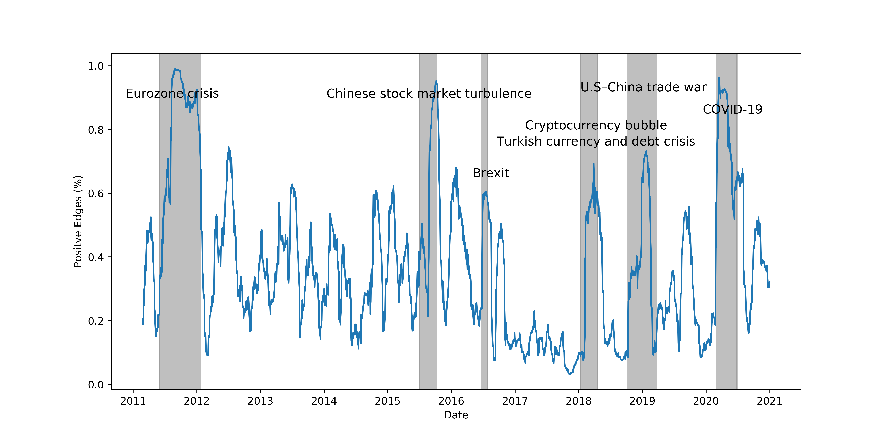
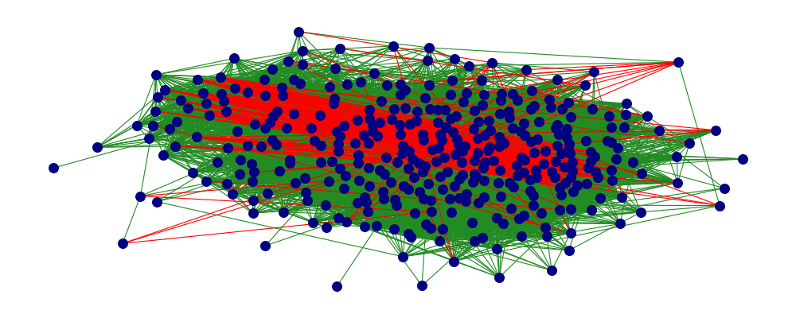
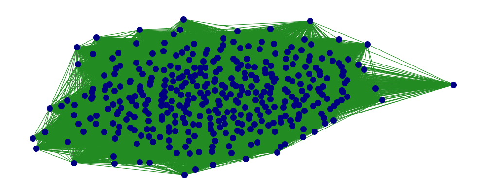
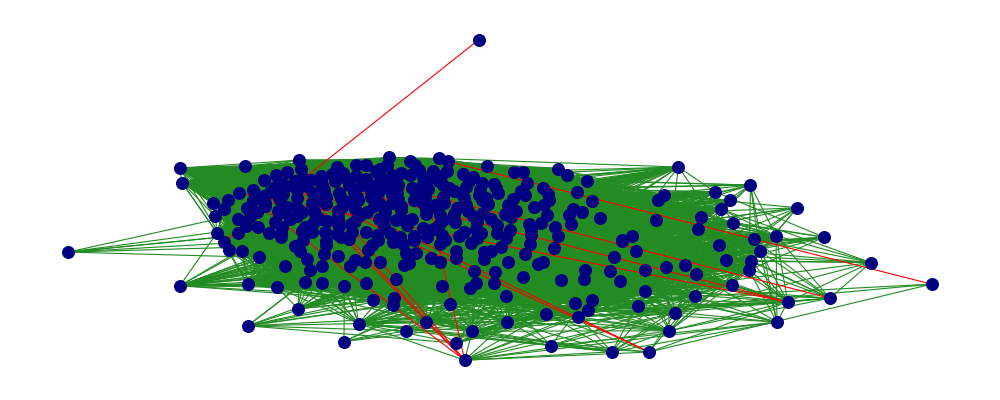
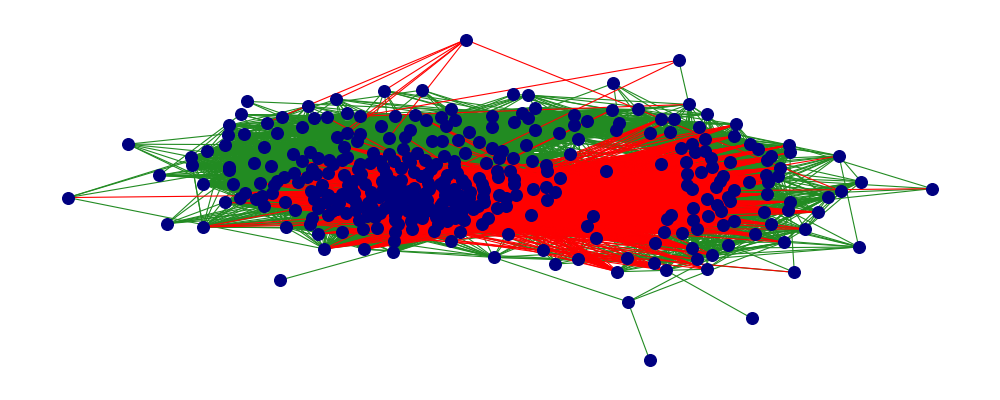

# Attention-Based-Dynamic-Graph-Learning-Framework-for-Asset-Pricing
This is a tensorflow-keras implementation of our CIKM-2021 paper [**"Attention Based Dynamic Graph Learning Framework for Asset Pricing"**](https://dl.acm.org/doi/abs/10.1145/3459637.3482413)

 

### **Requirments** 
- numpy >= 1.19
- pandas >= 1.0.1
- sckitlearn >= 0.22.0
- matplotlib >= 3.1.0
- pyreadr >= 0.4.0
- tensorflow == 2.5.0
- keres == 2.3.1

### **DATA** 

The initial raw daily data can be downloaded from [Here](https://drive.google.com/file/d/15HG7-P5hUU8TtRmMDzY3_j_k-h_jyGwJ/view?usp=sharing). Caution this data set is very large about 330mb and consist of 3147312 rows and 14 colums. The data includes 1035 unique TIC id for firms.
Running the [Data_clean.py][Data_clean.py] will produce a clean pickle file namely daily_clear_ret.pickle with pandas data frame. 
The clean data shape is (928773, 27), with 25 features and TIC and CUSIP as identifying variable. 

### The Model
A Keras implementation of the Dy-Gap model proposed in the paper is presented in [Dy_Gap_Model.ipynb](Dy_Gap_Model.ipynb). 

###  Graph Evaluation and Statistics
The iPython Notebook [Figures_and_Statistics.ipynb](Figures_and_Statistics.ipynb) provide the related network statisitcs and their distribution. It also recreate some of the Figures from the paper.

###### The learned positive edges fromS&P-500 daily data. There are visible spikes in the degree of positive edges during financial, political, and economic events.
 
 
 
 
##### The network structure of S&P-500 stocks at different points of time. 
Green represents positive edges and red represents negative edges. During the normal economic condition, the market consists of a mixture of positive and negative edges. However, during the economic or political event, the network is dominated by positive edges, representing the commonality across firms.

 

 June 24 2016
 

 

  

 
  
 

March 23 2020.png

 

  

June 25 2020
 

 

  

 

 Dec_31_2020.png
  

   

  

### Citation
@inproceedings{Uddin2021_DYGCN, 
author = {Uddin, Ajim and Tao, Xinyuan and Yu, Dantong}, 
title = {Attention Based Dynamic Graph Learning Framework for Asset Pricing}, 
year = {2021}, 
isbn = {9781450384469}, 
publisher = {Association for Computing Machinery}, 
address = {New York, NY, USA}, 
url = {https://doi.org/10.1145/3459637.3482413}, 
doi = {10.1145/3459637.3482413}, 
booktitle = {Proceedings of the 30th ACM International Conference on Information & Knowledge Management}, 
pages = {1844–1853}, 
numpages = {10}, 
keywords = {asset pricing, fintech, graph neural networks, diffusion recurrent convolution, graph attention, stock price prediction}, 
location = {Virtual Event, Queensland, Australia}, 
series = {CIKM '21} 
}

  

