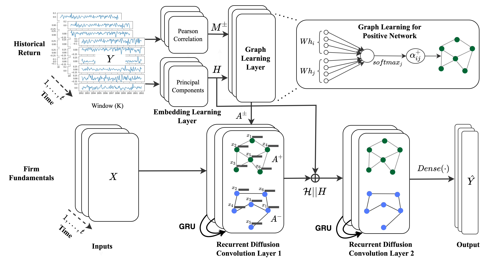

# Attention-Based-Dynamic-Graph-Learning-Framework-for-Asset-Pricing
This is a tensorflow-keras implementation of our CIKM-2021 paper [**"Attention Based Dynamic Graph Learning Framework for Asset Pricing"**](https://dl.acm.org/doi/abs/10.1145/3459637.3482413)

 

**DATA** 
The initial raw daily data is stored in [Data/SP_daily.csv](Data/SP_daily.csv) file. The data includes 1035 unique TIC id for firms. This data consist of 3147312 rows and 14 colums). This data set is very large 330mb. 
Running the [Data_clean.py][Data_clean.py] will produce a clean pickle [file](daily_clear_ret.pickle) with pandas data frame. 
The clean data shape is (928773, 27), with 25 features and TIC and CUSIP as identifying variable. 

